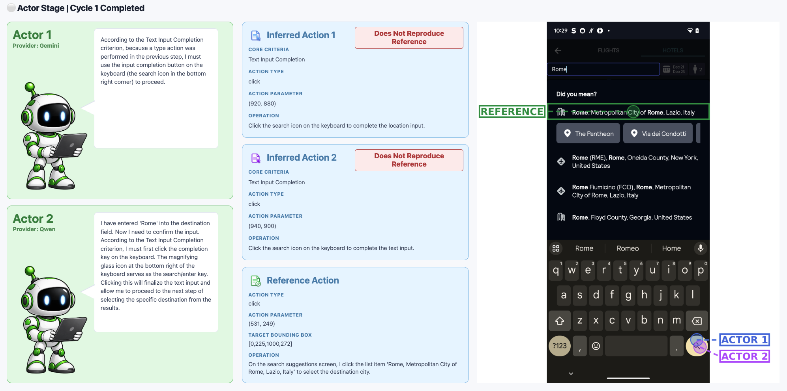
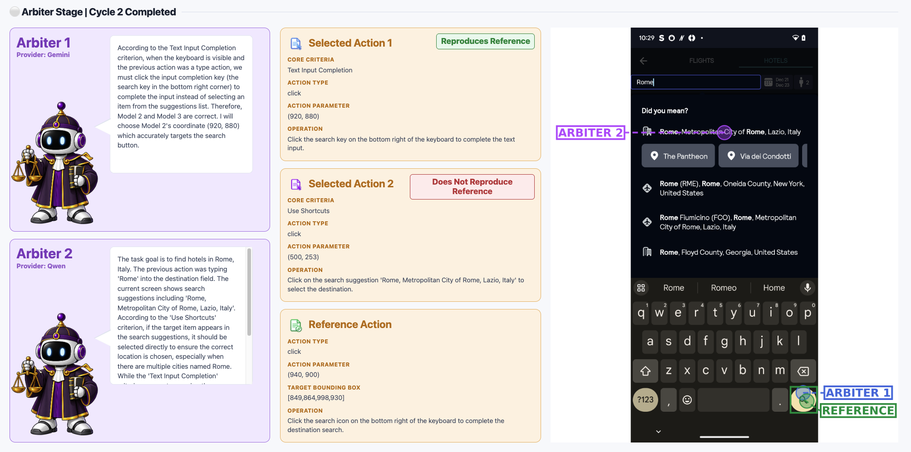
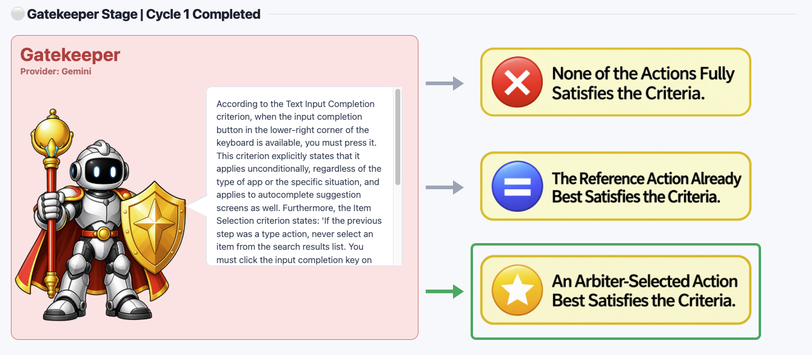

# Automatic Verification and Revision of Action Annotation in Offline GUI Agent Datasets

<p align="center">
  
  
  
</p>

These are the reproducibility materials for a paper submitted to FSE 2027. You can test the Actor, Arbiter, Gatekeeper, and bounding-box generation stages individually, or test the fully automated end-to-end pipeline.

These reproducibility materials provide a web-based GUI for testing the pipeline on individual steps.

---

## Quick Start

### Virtual Environment Setup

Create and configure a virtual environment using conda or venv.

```bash
python3.12 -m venv venv
source venv/bin/activate
pip install --upgrade pip
pip install -r requirements.txt
```

### MLLM API Configuration

Running this pipeline requires a Google AI Studio API key and a Qwen model hosted on a local server.
Copy `.env.example` to `.env`, then enter the corresponding settings in `.env`.

If you cannot set up a local server to host Qwen, you can run all modules using Gemini alone. To do so, replace every `qwen` value in `config.yaml` with `gemini`. Note, however, that this may compromise the cross-model verification setup intended in this study.

### Launching the Test Web Interface

```bash
bash start_web.sh
```

- After launching the web interface, click the Run Pipeline button in the End-to-End Pipeline tab to run the full pipeline.
- Each module's Test tab lets you inspect its input and output structure in detail. Click the individual Run button in the block featuring the corresponding character.

### Sample Data

This repository includes one sample episode in a format ready for use with the pipeline. To run the pipeline on other episodes, prepare their data in the same format as the sample in `sample_data` and place it under `sample_data`.
